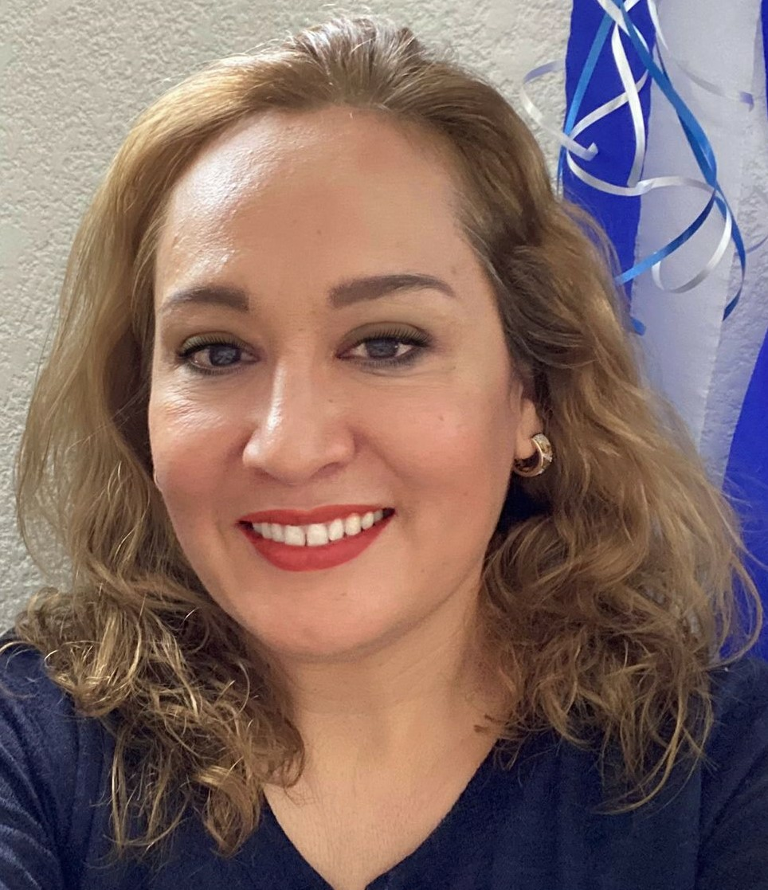
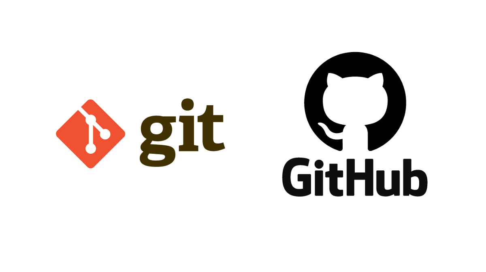
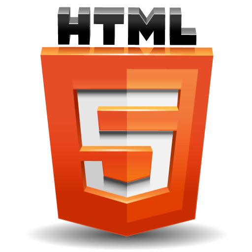
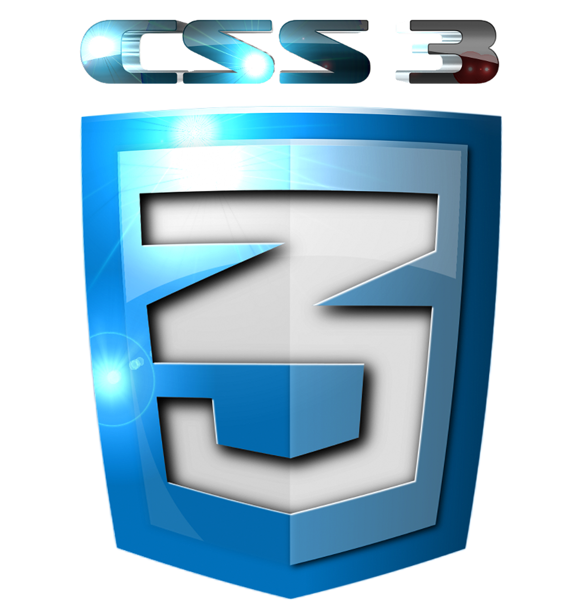
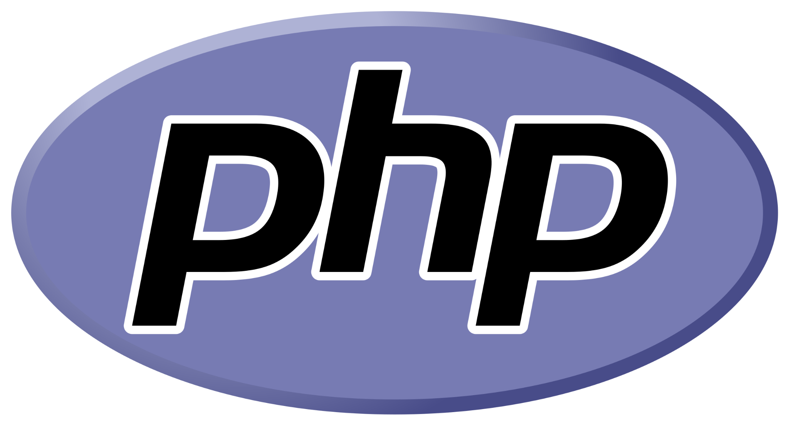
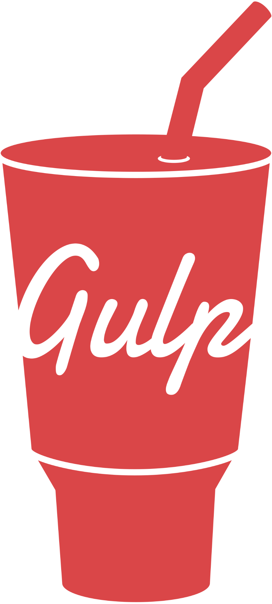
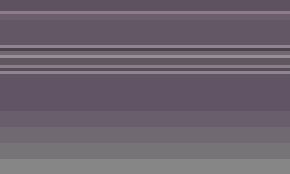
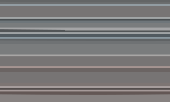

# ⚜️¡Hola a todos! 👋 Mi nombre es Elizabeth Araceli

## ✨Soy Licenciada en Ingeniería en Sistemas Computacionales✨

### 🦋En el 2021 me titulé, actualmente, me encuentro en capacitación en Desarrollo Web con el objetivo de convertirme en Full Stack 🦋 
#### - 💥 Me encanta estar aprendiendo cosas nuevas constatemente 💥

#### - 👩‍🎓 Estoy cursando Desarrollo Web en Udemy
#### - 👩‍🎓 Llevo un curso de Git y GitHub desde Cero en Udemy
#### - 🙏 Estoy buscando ingresar a Laboratoria
_________________________________________________________________________________________________

### Contactame!:

#### - 📫 Mi correo es: 📧 elizabethlpz@live.com.mx
_________________________________________________________________________________________________

### 🖥️ Lenguajes y 🛠️Herramientas que utilizo:

 

 

___________________________________________________________________________________________________

### 👩‍💻 Mis proyectos:

- :point_right: [Proyecto 01 - Sitio Freelancer](https://elizabeth-araceli-freelancer.netlify.app/)

- :point_right: [Proyecto 02 - Sitio frontend Store](https://frontend-store-eli.netlify.app/)

- :point_right: [Proyecto 03 - ]()

- :point_right: [Proyecto 04 - Blog de Café ](https://blog-de-cafe-eli-crnl.netlify.app/)

- :point_right: [Proyecto 05 - Sitio Rock & EMD Festival](https://rock-and-edm-festival-eli.netlify.app/)

- :point_right: [Proyecto 06 - ]()

- :point_right: [Proyecto 07 - ]()

- :point_right: [Proyecto 08 - ]()

- :point_right: [Proyecto 09 - ]()

- :point_right: [Proyecto 10 - ]()

