# ⚜️¡Hola a todos! 👋 Mi nombre es Elizabeth Araceli

## ✨Soy Ingeniera en Sistemas Computacionales con más de 20 años de experiencia en la iniciativa privada y pública en el área administrativa, y en transición al Desarrollo Web desde 2021. ✨

### 🦋 Actualmente, me encuentro en capacitación en Desarrollo Web con el objetivo de convertirme en Full Stack
#### - 💥 Me encanta estar aprendiendo cosas nuevas constatemente 💥

#### - 👩‍🎓 Estoy cursando Desarrollo Web en Udemy
#### - 👩‍🎓 Llevo un curso de Git y GitHub en Udemy
#### - 👩‍🎓 Curso JavaScript en Udemy

_________________________________________________________________________________________________

### Contactame!:

#### - 📫 Mi correo es: 📧 elizabethlpz@live.com.mx
_________________________________________________________________________________________________

### 🖥️ Lenguajes y 🛠️Herramientas que utilizo:

 
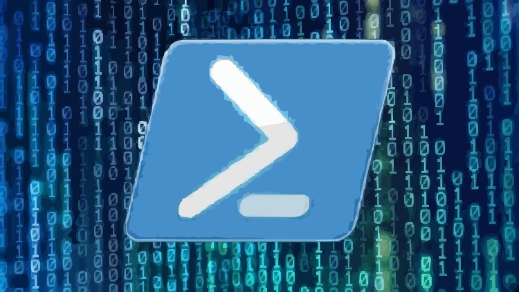
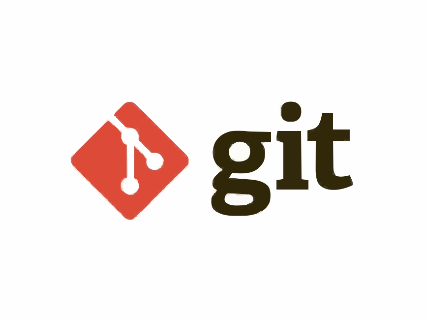
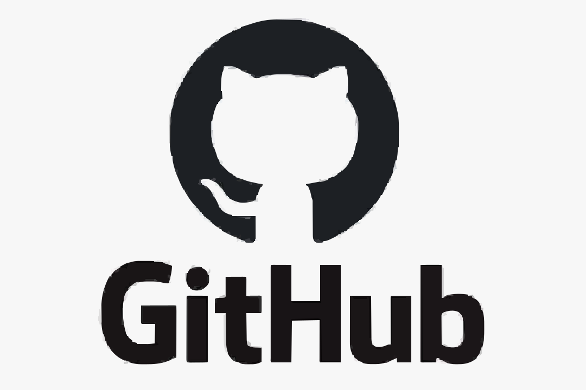
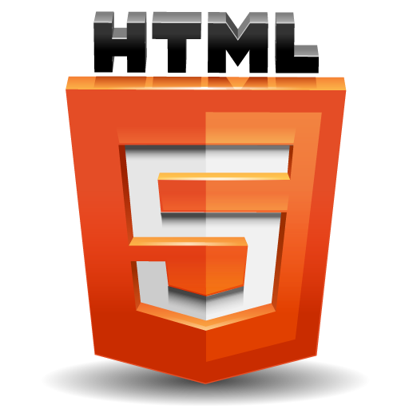
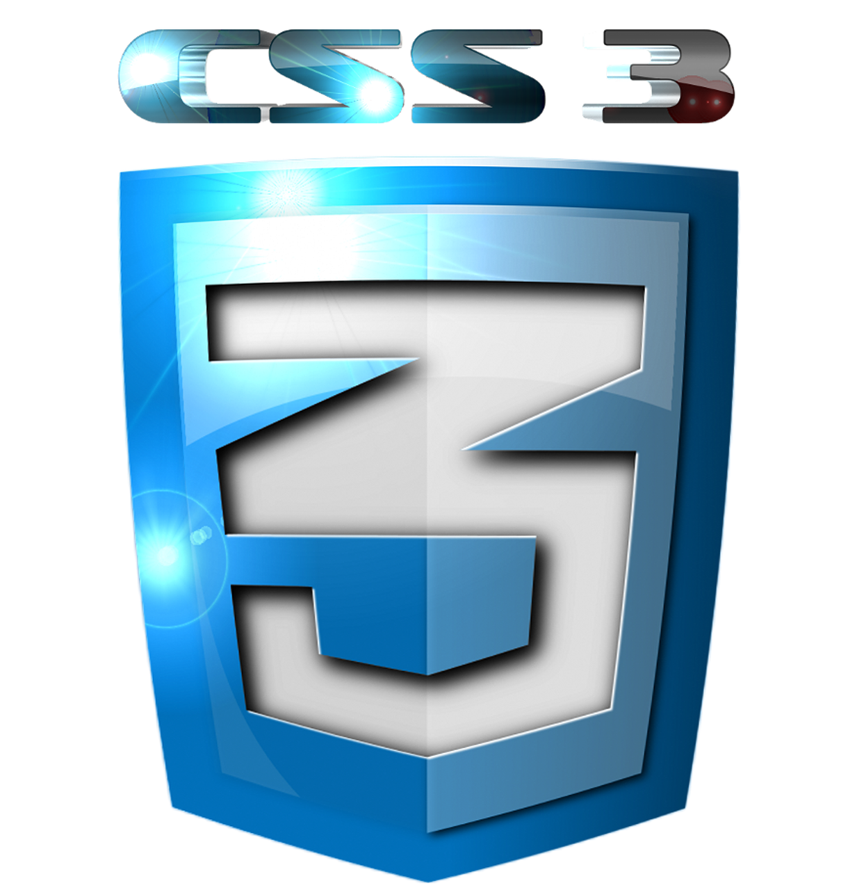

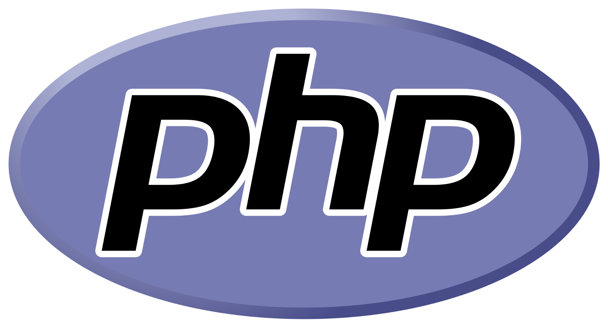
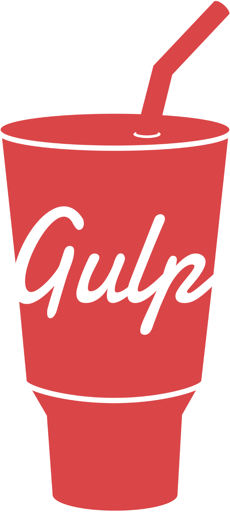
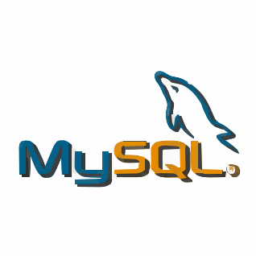
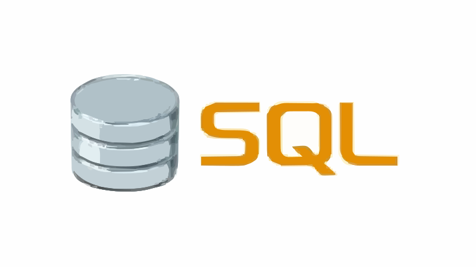
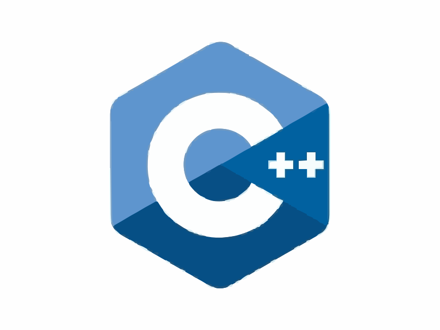
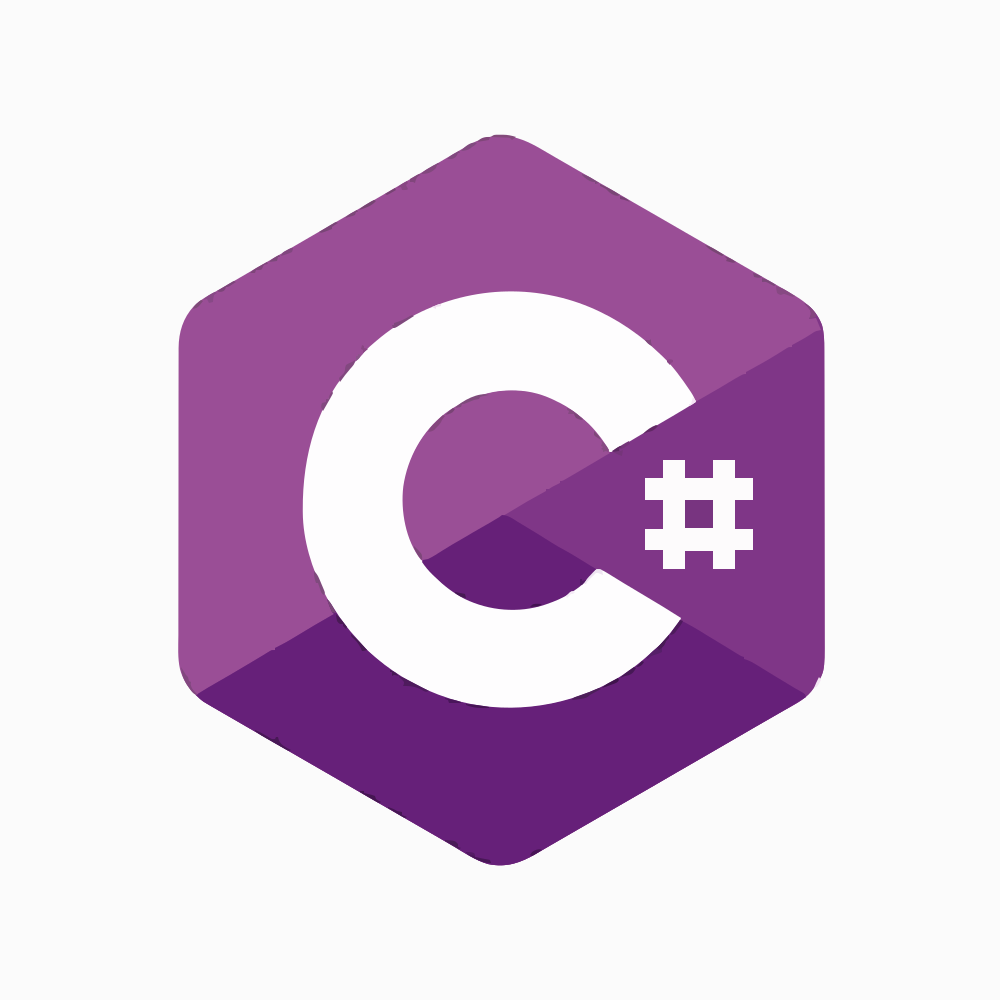
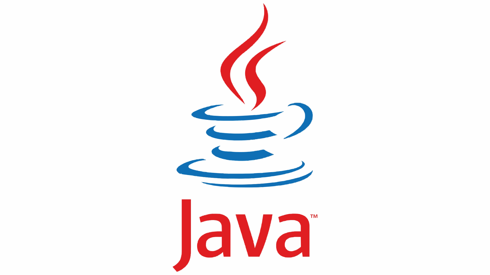
 

___________________________________________________________________________________________________

### 👩‍💻 Mis proyectos:

- :point_right: [Proyecto 01 - Sitio Freelancer](https://elizabeth-araceli-freelancer.netlify.app/)

- :point_right: [Proyecto 02 - Sitio frontend Store](https://frontend-store-eli.netlify.app/)

- :point_right: [Proyecto 03 - Blog de Café ](https://blog-de-cafe-eli-crnl.netlify.app/)

- :point_right: [Proyecto 04 - Sitio Rock & EMD Festival](https://rock-and-edm-festival-eli.netlify.app/)

- :point_right: [Proyecto 05 - Bienes raices](https://bienesraiceseli.netlify.app/)

- :point_right: [Proyecto 06 - Carrito de compras con JavaScript](https://carritoeli.netlify.app/)

